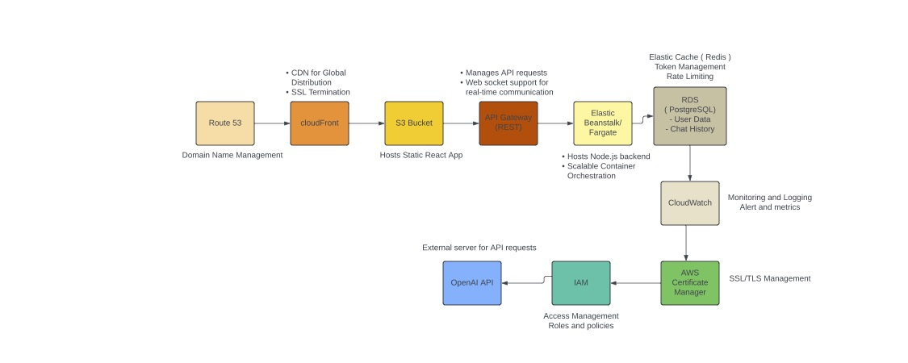

# Full Stack AI-Powered Chatbot Application

## Project Overview

This project is a full stack web application that allows users to interact with an AI-powered chatbot. The application is built using React for the frontend and Node.js for the backend, with a focus on user authentication, real-time communication, and efficient token usage.

## Features

### Frontend (React)
- Responsive and intuitive user interface for the chat application
- User registration and login functionality
- Chat interface displaying conversation between the user and the AI chatbot
- Real-time updates to the chat interface as messages are exchanged
- Token usage tracker displaying the user's token consumption in real-time
- Notifications for approaching token limits

### Backend (Node.js)
- RESTful API for user authentication, chat functionality, and token management
- Integration with an AI language model API (e.g., OpenAI's GPT-3.5)
- Rate limiting and throttling mechanisms to ensure fair usage and prevent abuse
- Token usage tracking and enforcement of daily token limits (e.g., 1000 tokens per day)
- Secure user authentication using JWT
- Database (MongoDB) for storing user information, chat history, and token usage data

### Real-time Communication
- Real-time communication between the frontend and backend using WebSocket
- Instant and reliable message delivery between the user and the AI chatbot
- Graceful connection management, error handling, and reconnection logic

### Dockerization
- Containerization of frontend and backend applications using Docker
- Separate Dockerfiles for the frontend and backend with necessary dependencies, build steps, and runtime configurations
- Docker Compose file to orchestrate containers and handle communication between frontend, backend, and database

## Architecture

  

## Installation and Setup

### Prerequisites
- Docker
- Node.js and npm
- MongoDB

### Steps to Run Locally

1. **Clone the Repository**
    ```bash
    git clone https://github.com/kallatitharun/TharunReddy-Kallati-AnswersAi-FullStack.git
    cd TharunReddy-Kallati-AnswersAi-FullStack
    ```

2. **Set Up Environment Variables**
    - Create a `.env` file in both the `frontend` and `backend` directories.
    - Add the necessary environment variables as specified in the `.env.example` files.

3. **Build and Run Docker Containers**
    ```bash
    docker-compose up --build
    ```

4. **Access the Application**
    - The frontend will be available at `http://localhost:3000`
    - The backend API will be available at `http://localhost:5000`

## Testing

### Frontend
- Run unit tests and integration tests using your preferred testing framework (e.g., Jest)
    ```bash
    cd frontend
    npm install
    npm test
    ```

### Backend
- Run unit tests and integration tests using your preferred testing framework (e.g., Mocha)
    ```bash
    cd backend
    npm install
    npm test
    ```


## Demo

[Link to Demo Video](https://drive.google.com/file/d/1hVmw7WOZfH_l-KIsFUM-cpBSU91f7gSt/view?usp=sharing)


This project was developed as part of the AnswersAi Fullstack Challenge. The goal was to create a scalable and efficient AI-powered chatbot application with a strong focus on user experience, real-time communication, and secure authentication.
